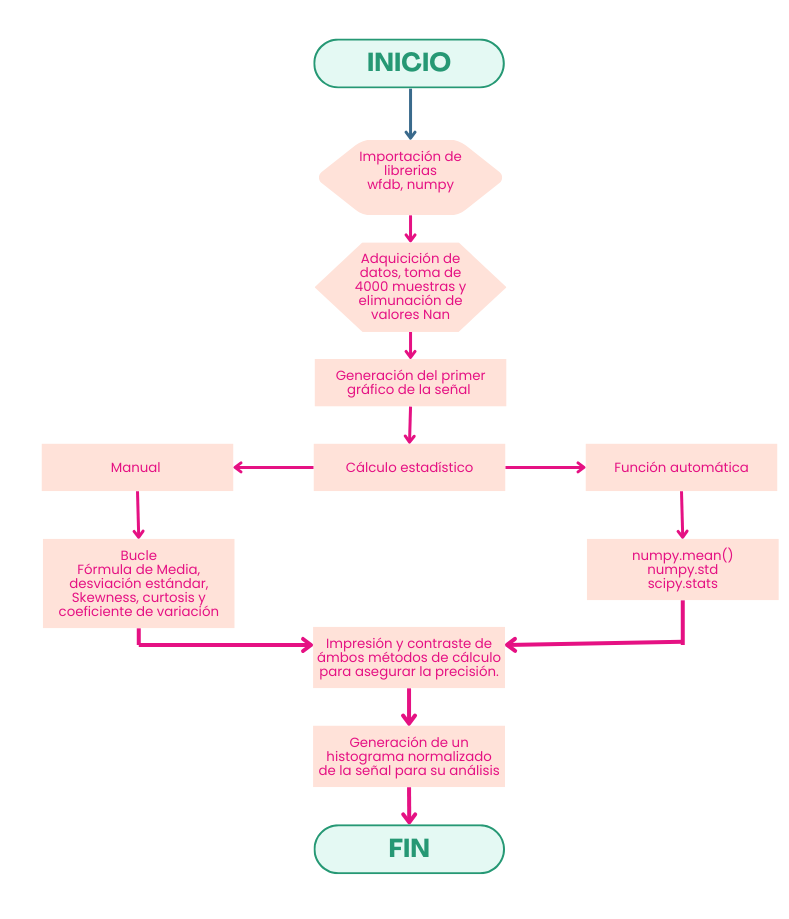
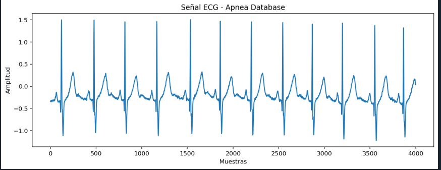
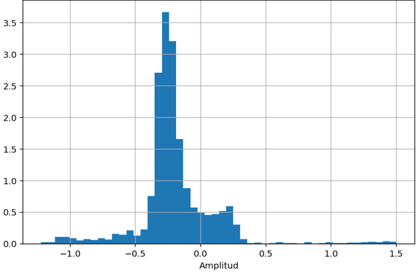

# Análisis estadístico de señales 
## Primer Laboratorio procesamiento digital de señales

**Maria Camila Ospina Jara, Juan Felipe Serna Alarcón**

### Descripción
En este laboratorio se realizó la caracterización estadística de una señal biomédica con el fin de describir su comportamiento mediante parámetros descriptivos. 
Se trabajó con características no fiduciales, es decir, aquellas que analizan la señal como un conjunto completo sin depender de la detección de puntos específicos 
como picos o eventos particulares.
El objetivo principal fue calcular y analizar parámetros estadísticos como la media, desviación estándar, coeficiente de variación, asimetría, curtosis e 
histogramas, utilizando herramientas de programación en Python. Estos cálculos se realizaron tanto implementando las fórmulas desde cero como empleando funciones 
predefinidas de librerías especializadas.

### Desarrollo de la páctica 
### Parte A

En esta primera etapa del laboratorio se descargó una señal ECG desde PhysioNet (Brno University of Technology ECG Database) y se realizó su importación, visualización y análisis estadístico[1][2].

#### Diagrama de flujo del código "PrimerLaboratorio.py"




**Señal ECG importada**




Se calcularon los siguientes parámetros:
+ Media
+ Desviación estándar
+ Coeficiente de variación
+ Skewness
+ Curtosis

1. Manualmente (programando las fórmulas)
```python
# Media
media_manual = sum(senal) / N

# Desviación estándar
suma = 0
for x in senal:
    suma += (x - media_manual) ** 2
desv_manual = (suma / N) ** 0.5

# Coeficiente de variación
if media_manual != 0:
    cv_manual = desv_manual / media_manual
else:
    cv_manual = 0

# Skewness
suma_skew = 0
for x in senal:
    suma_skew += ((x - media_manual) / desv_manual) ** 3
skew_manual = suma_skew / N

# Curtosis
suma_kurt = 0
for x in senal:
    suma_kurt += ((x - media_manual) / desv_manual) ** 4
kurt_manual = suma_kurt / N


```
2. Usando funciones de NumPy y SciPy
```python
# Media
media_np = np.mean(senal)
# Desviación estándar
desv_np = np.std(senal)
#Coeficiente de variación
cv_np = desv_np / media_np #el coeficiente siempre es positivo
# Skewness
skew_np = stats.skew(senal)
# Curtosis
kurt_np = stats.kurtosis(senal, fisher=False)  # para que coincida con el manual

```
Y se obtuvieron los siquientes resultados

Media: -0.19348138119299282

Desv estándar: 0.2946382102175074

CV: 1.5228246170292385

Skewness: 1.3747776389974853

Curtosis: 11.601684982096616

***Histograma***

Con el fin de analizar la distribución estadística de la señal ECG, se construyó un histograma de sus valores de amplitud.
El histograma permite visualizar la frecuencia con la que aparecen determinados rangos de amplitud dentro de la señal, proporcionando una representación gráfica de su comportamiento estadístico.
Esta herramienta es útil para evaluar la simetría, dispersión y forma de la distribución, lo cual se relaciona directamente con parámetros como la media, la desviación estándar, la asimetría (skewness) y la curtosis.




---

### Parte B: Captura de la señal


Se generó una señal ECG usando un generador fisiológico y fue adquirida mediante STM32


Muestra de los primero 5 segundos de la señal


Los estadisticos de esos 5 seg

----- ANALISIS ECG (5 s) -----

Media: 0.0014590164967198459

Desviacion estandar: 0.22663213223260037

Coeficiente de variacion: 155.33212457988904

Asimetria (skewness): 1.6704965004522951

Curtosis: 6.3865478790626895

--Histograma de la señal--


### Parte C: 

#### Relación señal-ruido (SNR)

La relación señal-ruido (SNR, Signal to Noise Ratio) es un parámetro que cuantifica la calidad de una señal al comparar la potencia de la señal útil con la potencia del ruido que la afecta. Se define como el cociente entre la potencia de la señal y la potencia del ruido, y generalmente se expresa en decibelios (dB) mediante una escala logarítmica. Un valor alto de SNR indica que la señal predomina sobre el ruido, lo que implica mayor claridad y fidelidad en la información transmitida o registrada; por el contrario, un valor bajo de SNR significa que el ruido tiene una influencia significativa y puede distorsionar o dificultar la interpretación de la señal. Este parámetro es fundamental en áreas como la electrónica, las telecomunicaciones y el procesamiento de señales biomédicas, por ejemplo en el análisis de electrocardiogramas (ECG), donde una adecuada relación señal-ruido permite identificar con precisión las características relevantes de la señal fisiológica [3][4].


En la parte C se contaminó la señal con:

+ Ruido Gaussiano


```python
def ruido_gaussiano(signal, sigma=0.05):
    ruido = np.random.normal(0, sigma, len(signal))
    return signal + ruido# posteriormente se llamo la funcion para aplicar el ruido lo mismo para los demas tipos de ruido
```
 
+ Ruido Impulso


```python
def ruido_impulso(signal, prob=0.01, amp=2):
    signal_ruido = signal.copy()
    n = len(signal)

    for i in range(n):
        if np.random.rand() < prob:
            signal_ruido[i] += amp * (2*np.random.rand()-1)

    return signal_ruido
```
+ Ruido tipo Artefacto


```python
def ruido_artefacto(signal, fs):
    t = np.arange(len(signal))/fs
    
    # movimiento base respiratorio
    baseline = 0.3*np.sin(2*np.pi*0.3*t)
    
    # ruido muscular EMG
    emg = 0.15*np.sin(2*np.pi*35*t) * np.random.randn(len(signal))

    return signal + baseline + emg
```

Se calculó la Relación Señal-Ruido (SNR) usando:

SNR = 10 log10(Pseñal / Pruido)

```python
def calcular_snr(senal_limpia, senal_ruidosa):

    senal_limpia = np.array(senal_limpia)
    senal_ruidosa = np.array(senal_ruidosa)

    ruido = senal_ruidosa - senal_limpia

    potencia_senal = np.sum(senal_limpia**2)
    potencia_ruido = np.sum(ruido**2)

    snr = 10 * np.log10(potencia_senal / potencia_ruido)

    return snr
```

Se obtuvo: 

SNR Ruido Gaussiano:: 16.851709121441857 dB

SNR Ruido Impulso:: 5.560231707752167 dB

SNR Artefacto:: 8.532543794185596 dB

### Análisis
+ El ruido gaussiano produjo una SNR de 16.85 dB, indicando una calidad de señal moderadamente afectada. Aunque la señal aún conserva su estructura principal, la dispersión aumenta debido a la naturaleza aleatoria del ruido.
+ El ruido impulso generó una SNR de 5.56 dB, lo que indica que la potencia del ruido aun no supera la de la señal original pero de igual manera ya no se podria usar esta señal como base para estudio de fenomenos fisiologicos pues afectas puntos importantes como el conteo de complejos QRS que es una de las razones principales por las que se usan este tipo de señales.
+ El ruido tipo artefacto produjo una SNR de 7.93 dB, indicando una degradación considerable de la señal. Este tipo de ruido afecta principalmente la línea base, generando desplazamientos que pueden alterar parámetros estadísticos como la media.
+ En cuanto a la variabilidad, la desviación estándar es mayor en la Parte A (0.295 frente a 0.227), lo que indica que la señal importada presenta una mayor dispersión absoluta. Esto puede deberse a diferencias en ganancia, escalado, ruido instrumental o condiciones experimentales distintas.
+ Respecto a la forma de la distribución, ambas señales presentan asimetría positiva (skewness mayor que cero), lo que indica que existen más eventos extremos en el lado positivo que en el negativo. La Parte B muestra una asimetría ligeramente mayor (1.67 frente a 1.37), lo que sugiere que los picos positivos son relativamente más pronunciados o frecuentes en esa señal.
+ 

## Referencias

[1] L. Maršánová, A. Nemcova, R. Smisek, L. Smital, & M. Vitek (2021).  
Brno University of Technology ECG Signal Database with Annotations of P Wave (BUT PDB).  
PhysioNet. https://doi.org/10.13026/hvvj-5b53

[2] A. L. Goldberger et al. (2000).  
PhysioBank, PhysioToolkit, and PhysioNet: Components of a new research resource for complex physiologic signals.  
Circulation, 101(23), e215–e220.

[3] What is Signal to Noise Ratio and How to calculate it? (2024, July 17). Advanced PCB Design Blog | Cadence. https://resources.pcb.cadence.com/blog/2020-what-is-signal-to-noise-ratio-and-how-to-calculate-it

[4] Qué es Señal-Ruido. Diccionario Médico. Clínica U. Navarra. (n.d.). https://www.cun.es. https://www.cun.es/diccionario-medico/terminos/senal-ruido
