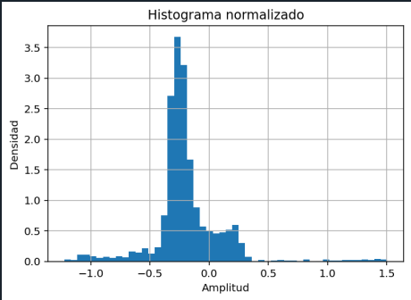

# Análisis estadístico de señales 
## Primer Laboratorio procesamiento digital de señales

**Maria Camila Ospina Jara, Juan Felipe Serna Alarcón**

### Descripción
En este laboratorio se realizó la caracterización estadística de una señal biomédica con el fin de describir su comportamiento mediante parámetros descriptivos. 
Se trabajó con características no fiduciales, es decir, aquellas que analizan la señal como un conjunto completo sin depender de la detección de puntos específicos 
como picos o eventos particulares.
El objetivo principal fue calcular y analizar parámetros estadísticos como la media, desviación estándar, coeficiente de variación, asimetría, curtosis e 
histogramas, utilizando herramientas de programación en Python. Estos cálculos se realizaron tanto implementando las fórmulas desde cero como empleando funciones 
predefinidas de librerías especializadas.

### Desarrollo de la páctica 
### Parte A: Señal de Physionet
En esta primera etapa del laboratorio se descargó una señal ECG desde PhysioNet (Brno University of Technology ECG Database) y se realizó su importación, visualización y análisis estadístico.

**Señal ECG importada**


---
Se calcularon los siguientes parámetros:
+ Media
+ Desviación estándar
+ Coeficiente de variación
+ Skewness
+ Curtosis

Manualmente (programando las fórmulas)
```python
# Media
media_manual = sum(senal) / N

# Desviación estándar
suma = 0
for x in senal:
    suma += (x - media_manual) ** 2
desv_manual = (suma / N) ** 0.5

# Coeficiente de variación
if media_manual != 0:
    cv_manual = desv_manual / media_manual
else:
    cv_manual = 0

# Skewness
suma_skew = 0
for x in senal:
    suma_skew += ((x - media_manual) / desv_manual) ** 3
skew_manual = suma_skew / N

# Curtosis
suma_kurt = 0
for x in senal:
    suma_kurt += ((x - media_manual) / desv_manual) ** 4
kurt_manual = suma_kurt / N

}
```
Usando funciones de NumPy y SciPy
```python
# Media
media_np = np.mean(senal)
# Desviación estándar
desv_np = np.std(senal)
#Coeficiente de variación
cv_np = desv_np / media_np
# Skewness
skew_np = stats.skew(senal)
# Curtosis
kurt_np = stats.kurtosis(senal, fisher=False)  # para que coincida con el manual

```
Y se obtuvieron los siquientes resultados

Media: -0.19348138119299282

Desv estándar: 0.2946382102175074

CV: -1.5228246170292385

Skewness: 1.3747776389974853

Curtosis: 11.601684982096616

Con el fin de analizar la distribución estadística de la señal ECG, se construyó un histograma de sus valores de amplitud.
El histograma permite visualizar la frecuencia con la que aparecen determinados rangos de amplitud dentro de la señal, proporcionando una representación gráfica de su comportamiento estadístico.
Esta herramienta es útil para evaluar la simetría, dispersión y forma de la distribución, lo cual se relaciona directamente con parámetros como la media, la desviación estándar, la asimetría (skewness) y la curtosis.



---

### Parte B: Captura de la señal
Se generó una señal ECG usando un generador fisiológico y fue adquirida mediante STM32

### Parte C: 
Se contaminó la señal con:
+ Ruido Gaussiano
+ Ruido Impulso
+ Ruido tipo Artefacto

Se calculó la Relación Señal-Ruido (SNR) usando:
SNR = 10 log10(Pseñal / Pruido)

Se obtuvo: 
SNR Ruido Gaussiano: 16.98746766925424

SNR Ruido Impulso: -5.40275753605938

SNR Artefacto: 7.933635233700488

Se observó que:
+ El ruido impulso afecta significativamente la curtosis.
+ El ruido gaussiano aumenta la desviación estándar.
+ El artefacto modifica la media y la línea base.
+ A menor SNR, menor calidad de señal.

### Conclusiones
Los parámetros estadísticos permiten describir globalmente una señal biomédica.
Sin embargo, no son suficientes por sí solos para diagnosticar patologías, ya que no consideran la morfología específica de las ondas.

La SNR es una herramienta útil para evaluar la calidad de señal, pero depende del tipo de ruido presente.

## Referencias

[1] L. Maršánová, A. Nemcova, R. Smisek, L. Smital, & M. Vitek (2021).  
Brno University of Technology ECG Signal Database with Annotations of P Wave (BUT PDB).  
PhysioNet. https://doi.org/10.13026/hvvj-5b53

[2] A. L. Goldberger et al. (2000).  
PhysioBank, PhysioToolkit, and PhysioNet: Components of a new research resource for complex physiologic signals.  
Circulation, 101(23), e215–e220.
